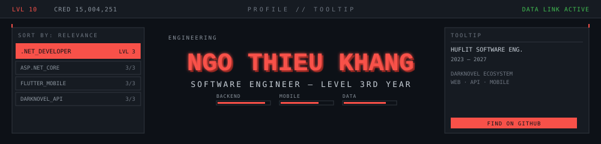

 

 

### Summary

Backend-focused developer with a working mobile stack on the side. Built the DarkNovel ecosystem end-to-end — website, API, and mobile app — across three codebases sharing one database. IELTS 7.0, comfortable reading technical documentation in English.

 

### Stack

| Layer | Tools |
|---|---|
| Backend |    |
| Mobile |    |
| Databases |    |
| Testing |  |

 

### Projects — DarkNovel Ecosystem

| Repo | Period | Highlights |
|---|---|---|
| **Web Platform** | Jul 2025 – Present | EPUB/PDF/DOCX extraction, XSS-safe sanitization, virtual coin economy, rankings, threaded comments |
| **REST API** | May 2026 – Present | Shared EF Core schema, dual auth (Cookies + JWT), global rate limiting, paginated endpoints |
| **Mobile App** | May 2026 – Present | Text-to-Speech + live translation reader, Dio with JWT interceptors, ValueNotifier state |

 

### Education

| | |
|---|---|
| Degree | Bachelor of Software Engineering |
| School | HCMC University of Foreign Languages – Information Technology (HUFLIT) |
| Timeline | 2023 – 2027 |
| GPA | 3.40 / 4.0 (124/141 credits) |

